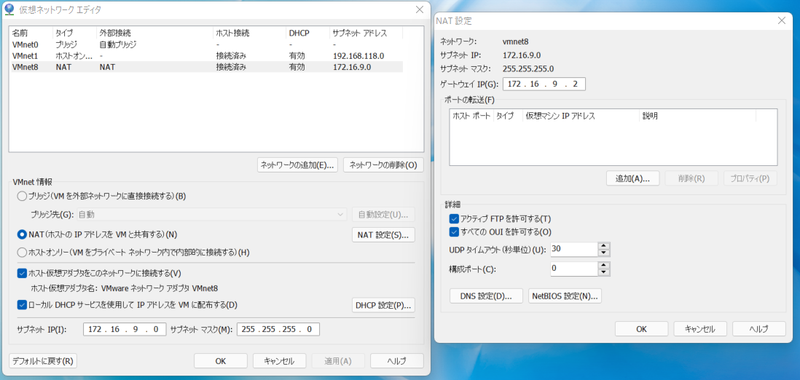

# vmware Ubuntu Server 20.04.4 LTS can not connect to the internet

- ## check nslookup
  nslookup working
  ```
  nslookup google.com
  ```

- ## check ping
  ping is not working
  ```
  ping google.com
  ```

- ## check ip setting
  check configin /etc/netplan/00-installer-config.yaml
  ```
  cat /etc/netplan/00-installer-config.yaml
  ouput:
  network:
    ethernets:
      ens33:
        addresses:
        - 172.16.9.78/24
        gateway4: 172.16.9.1
        nameservers:
          addresses:
          - 172.16.9.2
          - 8.8.8.8
          search: []
    version: 2
  ```
  
- ## check vmware network config
  config as shown below
   

- ## check the diff between ubuntu and vmware
  gateware is not same
  ```
  ubuntu: 172.16.9.1
  vmware: 172.16.9.2
  ```

- ## change the gateware to 172.16.9.2
  change the gateware to 172.16.9.2 and reboot it
  ```
  gateway4: 172.16.9.1
  ```
  ```
  sudo reboot
  ```