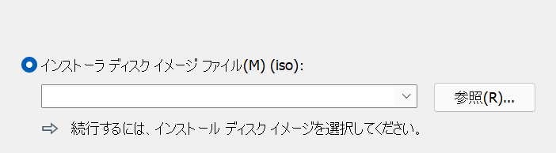
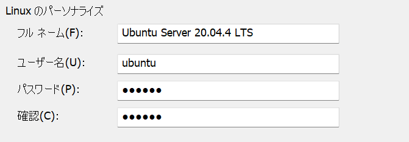
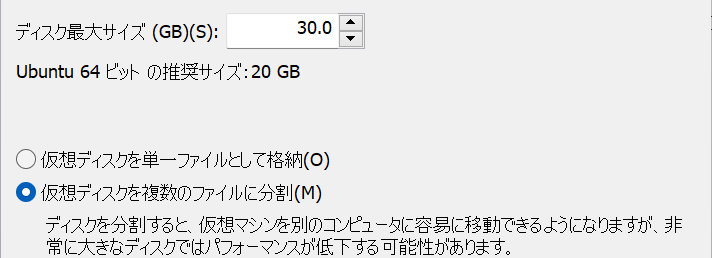
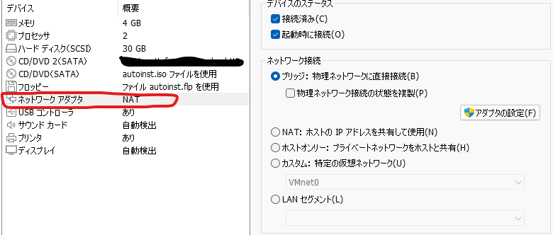
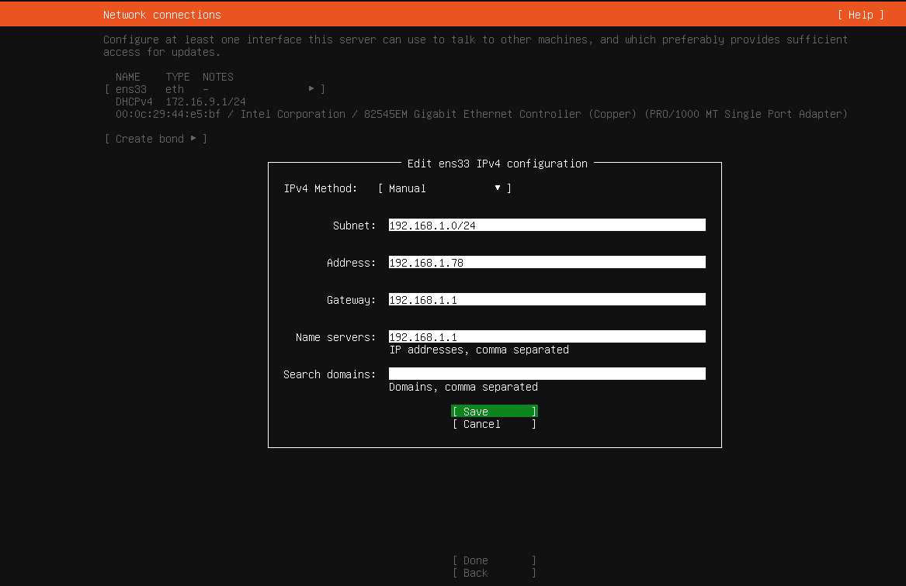
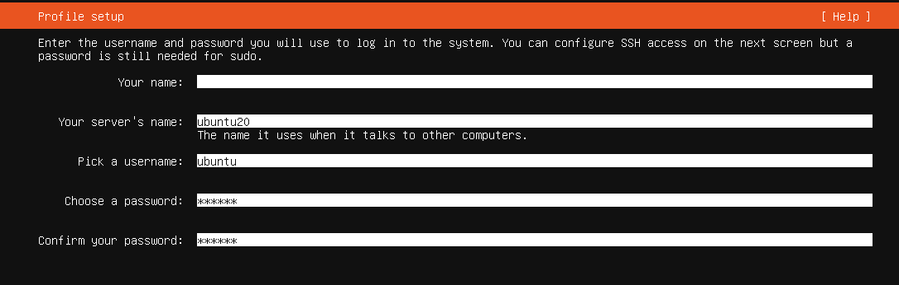
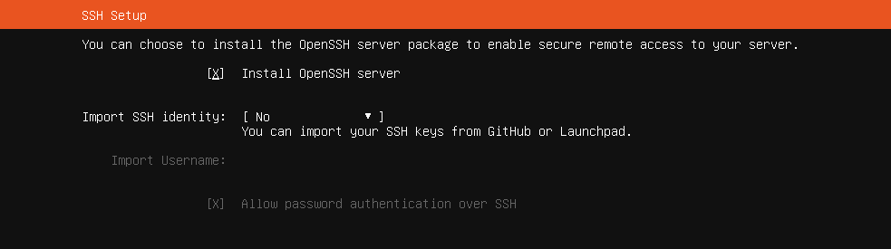

# create a virtual machine of Ubuntu Server 20.04.4 LTS through vmware

- ## download Ubuntu Server 20.04.4 LTS installation file
  download the installation file from the page below
  ```
  https://jp.ubuntu.com/download
  ```
- ## install file
  - Open vmware and click the button as shown below
   

  - Select the downloaded installation file as shown below
   

  - input the information as shown below
   
  
  - input the virtual machine name and select the save path <br>

  - input the disk size as you want and select the `Split the virtual disk into multiple files` as shown below
   

  - Confirm the information and change the Network adapter. <br>
    change from `NAT` TO `bridge` as shown below
     

  - Use UP, DOWN and ENTER keys to select your language.<br>

  - keyboard configuration, select your keyboard layout
  - Network Configure<br>
    Fixed IP config<br>
    `ens33` > `Edit IPv4` > `IPv4 Method: Manual`
    config as shown below
     

  - configure proxy<br>
    if you do not need to make any settings, just select `Done` and press the `Enter` key.

  - configure ubuntu archive mirrow<br>
    select `Done` and press the `Enter` key.

  - Guided storage configuration<br>
    select `Done` and press the `Enter` key.<br>
    the storage settings will be displayed.check the settings. and if there are no problems, select `Done` and press the `Enter` key.

  - profile setup<br>
    set as shown below
     

  - SSH Setup<br>
    config as shown below
     

  - Featured server snaps<br>
    check what you want

  - restart server
    Reboot the server after installation

    