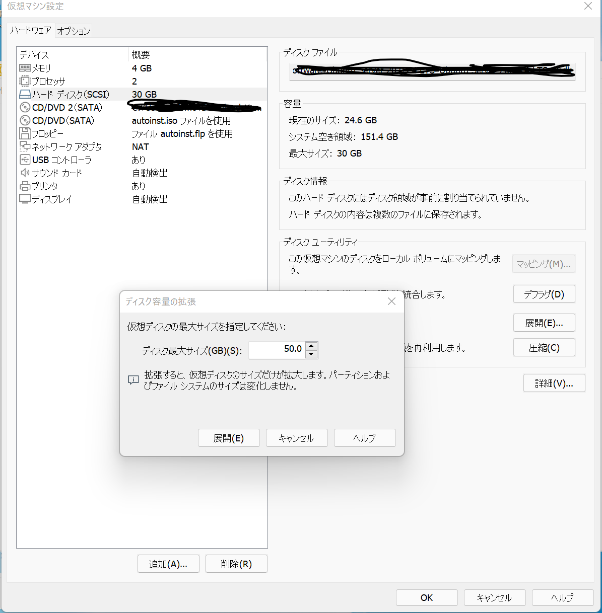

# vmware ubuntu HDD Expand

- ## Expand HDD capacity with VMWare 
    Increase Hard drive size from 30GB to 50GB
     

- ## use parted Increase Physical disk space
    - confirm free Hard drive size
        ```
        sudo parted /dev/sda
        (parted) print free
        ```
        ```
        output:
        GNU Parted 3.3
        /dev/sda を使用
        GNU Parted へようこそ！ コマンド一覧を見るには 'help' と入力してください。
        (parted) print free
        モデル: VMware, VMware Virtual S (scsi)
        ディスク /dev/sda: 53.7GB
        セクタサイズ (論理/物理): 512B/512B
        パーティションテーブル: gpt
        ディスクフラグ:

        番号  開始    終了    サイズ  ファイルシステム  名前  フラグ
            17.4kB  1049kB  1031kB  空き容量
        1    1049kB  2097kB  1049kB                          bios_grub
        2    2097kB  1613MB  1611MB  ext4
        3    1613MB  32.2GB  30.6GB
             32.2GB  53.7GB  21.5GB  空き容量
        ```
    
    - resizepart number 3<br/>
        input 53.7GB
        ```
        (parted) resizepart 3
        終了?  [32.2GB]? 53.7GB
        ```
    - confirm free Hard drive size again
        ```
        (parted) print free
        ```
        ```
        output:
        GNU Parted 3.3
        /dev/sda を使用
        GNU Parted へようこそ！ コマンド一覧を見るには 'help' と入力してください。
        (parted) print free
        モデル: VMware, VMware Virtual S (scsi)
        ディスク /dev/sda: 53.7GB
        セクタサイズ (論理/物理): 512B/512B
        パーティションテーブル: gpt
        ディスクフラグ:

        番号  開始    終了    サイズ  ファイルシステム  名前  フラグ
            17.4kB  1049kB  1031kB  空き容量
        1    1049kB  2097kB  1049kB                          bios_grub
        2    2097kB  1613MB  1611MB  ext4
        3    1613MB  32.2GB  30.6GB
             32.2GB  53.7GB  21.5GB  
        ```
    - exit parted
        ```
        (parted) q
        通知: 必要であれば /etc/fstab を更新するのを忘れないようにしてください。
        ```
- ## use pvresize Increase Physical volume
    - confirm Physical volume
  
        ```
        sudo pvdisplay
        ```
        ```
        output:
        --- Physical volume ---
            PV Name               /dev/sda3
            VG Name               ubuntu-vg
            PV Size               <28.50 GiB / not usable 0
            Allocatable           yes (but full)
            PE Size               4.00 MiB
            Total PE              7295
            Free PE               0
            Allocated PE          7295
            PV UUID               F7638X-zpwD-fBlw-C1Lr-0v4d-GhuS-5saa4e
        ```

    - resize Physical volume
        ```
        sudo pvresize /dev/sda3
        ```
    - confirm Physical volume again
        ```
        sudo pvdisplay
        ```
        ```
        output:
        --- Physical volume ---
        PV Name               /dev/sda3
        VG Name               ubuntu-vg
        PV Size               <48.50 GiB / not usable 16.50 KiB
        Allocatable           yes 
        PE Size               4.00 MiB
        Total PE              12415
        Free PE               5120
        Allocated PE          7295
        PV UUID               F7638X-zpwD-fBlw-C1Lr-0v4d-GhuS-5saa4e
        ```
- ## Expansion of logical disk space
    - confirm disk space
        ```
        sudo parted -l
        ```
        ```
        output:
        モデル: VMware, VMware Virtual S (scsi)
        ディスク /dev/sda: 53.7GB
        セクタサイズ (論理/物理): 512B/512B
        パーティションテーブル: gpt
        ディスクフラグ: 

        番号  開始    終了    サイズ  ファイルシステム  名前  フラグ
        1    1049kB  2097kB  1049kB                          bios_grub
        2    2097kB  1613MB  1611MB  ext4
        3    1613MB  53.7GB  52.1GB


        モデル: Linux device-mapper (linear) (dm)
        ディスク /dev/mapper/ubuntu--vg-ubuntu--lv: 30.6GB
        セクタサイズ (論理/物理): 512B/512B
        パーティションテーブル: loop
        ディスクフラグ: 

        番号  開始   終了    サイズ  ファイルシステム  フラグ
        1    0.00B  30.6GB  30.6GB  ext4
        ```
        ```
        sudo lsblk
        ```
        ```
        output:
        NAME                      MAJ:MIN RM  SIZE RO TYPE MOUNTPOINT
        fd0                         2:0    1  1.4M  0 disk 
        loop0                       7:0    0 61.9M  1 loop /snap/core20/1376
        loop1                       7:1    0 61.9M  1 loop /snap/core20/1361
        loop2                       7:2    0 67.8M  1 loop /snap/lxd/22753
        loop3                       7:3    0 43.6M  1 loop /snap/snapd/14978
        loop4                       7:4    0 67.9M  1 loop /snap/lxd/22526
        loop5                       7:5    0 43.6M  1 loop /snap/snapd/15177
        sda                         8:0    0   50G  0 disk 
        ├─sda1                      8:1    0    1M  0 part 
        ├─sda2                      8:2    0  1.5G  0 part /boot
        └─sda3                      8:3    0 48.5G  0 part 
        └─ubuntu--vg-ubuntu--lv 253:0    0 28.5G  0 lvm  /
        sr0                        11:0    1 97.2M  0 rom  
        sr1                        11:1    1  1.2G  0 rom  
        ```
        ```
        sudo lvdisplay
        ```
        ```
        output:
        --- Logical volume ---
        LV Path                /dev/ubuntu-vg/ubuntu-lv
        LV Name                ubuntu-lv
        VG Name                ubuntu-vg
        LV UUID                vgc0IG-Oi3p-iLyo-621X-cVKO-8h1g-xlABaZ
        LV Write Access        read/write
        LV Creation host, time ubuntu-server, 2022-03-03 15:58:33 +0900
        LV Status              available
        # open                 1
        LV Size                <28.50 GiB
        Current LE             7295
        Segments               1
        Allocation             inherit
        Read ahead sectors     auto
        - currently set to     256
        Block device           253:0  
        ```
    - extend disk space
        ```
        sudo lvextend --resizefs -l +100%FREE /dev/mapper/ubuntu--vg-ubuntu--lv
        ```
    - confirm disk space again
        ```
        sudo lvdisplay
        ```
        ```
        output:
        --- Logical volume ---
        LV Path                /dev/ubuntu-vg/ubuntu-lv
        LV Name                ubuntu-lv
        VG Name                ubuntu-vg
        LV UUID                vgc0IG-Oi3p-iLyo-621X-cVKO-8h1g-xlABaZ
        LV Write Access        read/write
        LV Creation host, time ubuntu-server, 2022-03-03 15:58:33 +0900
        LV Status              available
        # open                 1
        LV Size                <48.50 GiB
        Current LE             12415
        Segments               1
        Allocation             inherit
        Read ahead sectors     auto
        - currently set to     256
        Block device           253:0  
        ```